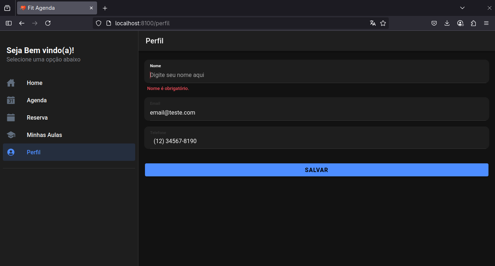
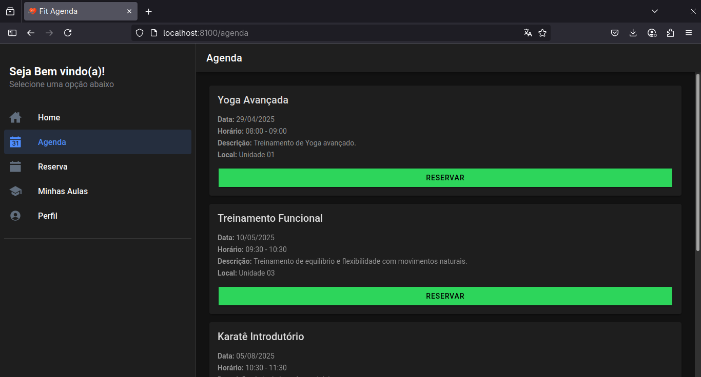

# 🏋️‍♂️ FitAgenda - App para Academia

## Aplicativo móvel feito com **Ionic + Angular** focado no acompanhamento de alunos de uma academia.

## ⚙️ Dependências

| Ferramenta | Versão |
| ---------- | ------ |
| Node.js    | v20.x  |
| npm        | v10.x  |
| Ionic CLI  | v7.x   |
| Angular    | v16.x  |
| ngx-mask   | ^17.x  |

Outros:

- `@ionic/angular`
- `@angular/forms`
- `ngx-mask`

---

## 💻 Rodar o projeto

- Clonar o repositório

```bash
git clone https://github.com/seu-usuario/fitagenda.git
cd fitagenda
```

- Instalar dependências

```bash
npm install
```

- Inicializar o app

```bash
ionic serve
```

---

## 📝 Notas

- Projeto ainda em desenvolvimento para fins acadêmicos.

---

## 📸 Screenshots



---
